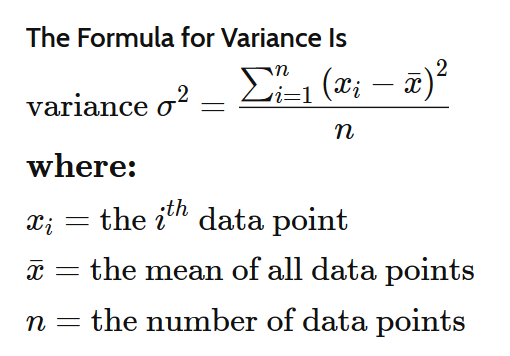

# Additional Exercises

If you want to practice, additional exercises are posted here weekly. 

<details>
<summary>Questions posted on Week 3 (27.02.2020)</summary>

Solutions are [here](https://github.com/zeynepyirmibes/cmpe150-spring20/tree/master/Additional%20Exercises/Week%203%20Solutions)

### Q1 - Rectangle

Write a program that reads two integers as the side lengths of a rectangle. Output the perimeter and the area of the rectangle.

|  INPUT  |  OUTPUT |
|:-------:|:-------:|
| 3 5   | 16 15  |

<br>

### Q2 - Average

Write a program that reads three integers from the user. Output the average of these three numbers. (Hint: Type Casting)

|  INPUT  |  OUTPUT |
|:-------:|:-------:|
| 2 3 5   | 3.33  |

<br>

### Q3 - To Lowercase

Write a program that reads a character from the user. Convert this character into lowercase , and print. (Hint: Difference between lowercase and uppercase characters are always the same)

|  INPUT  |  OUTPUT |
|:-------:|:-------:|
| A   | a  |
| T   | t  |

<br>

### Q4 - Increment-Decrement

Write a program that reads two integers from the user. Output the incremented version of the first number, and the decremented version of the second number. (Hint: Use the increment/decrement operators) 

|  INPUT  |  OUTPUT |
|:-------:|:-------:|
| 2 3 | 3 2 |
| 1 7 | 2 6 |

<br>

### Q5 - Seconds

Write a program to convert a given integer (in seconds) to hours, minutes and seconds. 

|  INPUT  |  OUTPUT |
|:-------:|:-------:|
| 120 | 0 hours 2 minutes 0 seconds |
| 67 | 0 hours 1 minutes 7 seconds |
| 3685 | 1 hours 1 minutes 25 seconds |

</details>

<details>
<summary>Questions posted on Week 4 (06.03.2020)</summary>

* Solutions are [here](https://github.com/zeynepyirmibes/cmpe150-spring20/tree/master/Additional%20Exercises/Week%204%20Solutions)

### Q6 - Leap Year

Write a program that reads the year (as an integer) from the user, and prints if it is a leap year or not. (You can google leap year)

|  INPUT  |  OUTPUT |
|:-------:|:-------:|
| 2016   | it is a leap year  |
| 2017   | it is not a leap year  |

<br>

### Q7 - Calculator

Write a basic calculator program (+, -, \*, /). The program takes three inputs: float, char, float, then prints the result. 

|  INPUT  |  OUTPUT |
|:-------:|:-------:|
| 1 + 45  | 46.00   |
| 1 - 45  | -44.00  |
| 1 * 45  | 45.00   |
| 1 / 45  | 0.02    |

<br>

### Q8 - Largest

Write a program that takes three integers from the user, and finds the largest of three numbers.

|  INPUT  |  OUTPUT |
|:-------:|:-------:|
| 12 25 52  | The 3rd is the greatest of all.  |
| 45 5 32  | The 1st is the greatest of all.  |

<br>

### Q9 - Quadrant

Write a program that takes (X,Y) coordinates from the user, and determines in which quadrant the coordinate point lies.

|  INPUT  |  OUTPUT |
|:-------:|:-------:|
| 7 9  | 1st quadrant  |
| -5 -4  | 3rd quadrant  |

<br>

</details>

<details>
<summary>Questions posted on Week 5 (26.03.2020)</summary>

Solutions are [here](https://github.com/zeynepyirmibes/cmpe150-spring20/tree/master/Additional%20Exercises/Week%205%20Solutions)

### Q10 - Infinite Numbers

Allow the user to enter natural numbers (integers) as long as they want. If the user inputs a negative number, then stop taking inputs, and print their sum (as an integer) and average (as a float). 
NOTE: Do not take the negative number into your calculation.  

INPUT: <br>
1 <br>
9 <br>
8 <br>
5 <br>
7 <br>
-3

OUTPUT: <br>
Sum = 30
Average = 6.0

### Q11 - Factorial

Write a program that takes an integer from the user, and prints the factorial *(do not use any pre-defined C function, compute the factorial yourself)*. If the user has entered a negative number, print "Wrong input!". 

|  INPUT  |  OUTPUT |
|:-------:|:-------:|
| 5  | 120  |
| 2 |  2 |
| -3  | Wrong input!  |

### Q12 - Exponential

Write a program that takes 2 integers a and b, then prints the result of a^b (a\*a\*a...\*a\*a) using a for/while loop. 

|  INPUT  |  OUTPUT |
|:-------:|:-------:|
| 3 4  | 81  |
| 7 2 |  49 |

### Q13 - Divisors

Take a positive integer from the user. Print its divisors. If the user inputs a negative integer, print "Wrong input!". 

|  INPUT  |  OUTPUT |
|:-------:|:-------:|
| 56  | 1 2 4 7 8 14 28 56  |
| 12 |  1 2 3 4 6 12 |
| -3  | Wrong input!  |

### Q14 - The Perfect Number

A **perfect number** is a positive integer that is equal to the sum of its proper divisors. The smallest perfect number is 6, which is the sum of 1, 2, and 3.

Take an integer from the user, and tell if it's a perfect number or not. If the user inputs a negative integer, print "Wrong input!". 

|  INPUT  |  OUTPUT |
|:-------:|:-------:|
| 56  | Not a perfect number.  |
| 28 |  Perfect number!!! |
| 496 |  Perfect number!!! |
| -3  | Wrong input!  |

### Q15 - Prime Number

Take an integer from the user, and tell if it's a prime number or not. If the user inputs a negative integer, print "Wrong input!". 

|  INPUT  |  OUTPUT |
|:-------:|:-------:|
| 18  | Not a prime number.  |
| 13 |  Prime number!!! |
| -3  | Wrong input!  |

### Q16 - Fibonacci

Take an integer **n** from the user, and print the first **n** terms of Fibonacci series.

|  INPUT  |  OUTPUT |
|:-------:|:-------:|
| 5  | 0 1 1 2 3  |
| 10 |  0 1 1 2 3 5 8 13 21 34  |

### Q17 - Digits in a Number

##### Q17a: Number of Digits

Take an integer number from the user, and print the number of digits in it. 

|  INPUT  |  OUTPUT |
|:-------:|:-------:|
| 5  | 1  |
| 789  | 3  |
| 46416465 |  8  |

##### Q17b: Sum of Digits

Take an integer number from the user, and print the sum of the digits in it. 

|  INPUT  |  OUTPUT |
|:-------:|:-------:|
| 5  | 5 |
| 789  | 24  |
| 46416465 |  36  |

</details>

<details>
<summary>Questions posted on Week 6 (12.04.2020)</summary>

Solutions are [here](https://github.com/zeynepyirmibes/cmpe150-spring20/tree/master/Additional%20Exercises/Week%206%20Solutions)

### Q18: Half Diamond Star

Write a C program to print a half diamond star pattern using for loop.

INPUT: <br>
5
OUTPUT: <br>
```c
*
**
***
****
*****
****
***
**
*
```


### Q19: Hollow Triangle

Write a C program to print the given triangle number pattern using 0, 1.

INPUT: <br>
6
OUTPUT: <br>
```c
1
11
101
1001
10001
111111
```

### Q20: Valid Triangle

Write a C program that takes three sides of a triangle and check whether the triangle is valid or not. (Apply the rule (side1 + side2 > side3) to all sides)

|  INPUT  |  OUTPUT |
|:-------:|:-------:|
| 7 4 10  | Valid |
| 1 3 1  | Invalid  |

### Q21: 100 Characters

Take a maximum of 100 characters from the user. Stop taking inputs when the user enters dot (.), and print the number lowercase, uppercase letters, and the number of digits the user entered. Use break. (Take the characters with enter (newline) between them)

INPUT: <br>
a <br>
Y  <br>
6  <br>
8  <br>
T  <br>
W <br>
.  <br>
OUTPUT: <br>
Lowercase: 1 <br>
Uppercase: 3  <br>
Digit: 2  <br>

### Q22: Harmonic

Write a program in C to display the n terms of harmonic series and their sum.

|  INPUT  |  OUTPUT |
|:-------:|:-------:|
| 3  | 1/1 + 1/2 + 1/3 = 1.833333 |
| 5  | 1/1 + 1/2 + 1/3 + 1/4 + 1/5 = 2.283334  |

</details>

<details>
<summary>Questions posted on Week 7 (16.04.2020)</summary>

Solutions are [here](https://github.com/zeynepyirmibes/cmpe150-spring20/tree/master/Additional%20Exercises/Week%207%20Solutions)

### Q23: Number Pyramid

* Write a function named **pyramid** which takes an integer as input: **num_of_rows**, then prints the pyramid of numbers increased by 1 shown below. This function shouldn't return anything.
* Then write main appropriately to see the result.

```c
Input:
4

Output:
   1
  2 3
 4 5 6
7 8 9 10


Input:
3

Output:
  1
 2 3
4 5 6
```

### Q24: Binary

* Write a function that will take an integer as a parameter. Then calculates and returns its binary version as another integer. Then write main appropriately to see the result.

* You can reference [this link](https://www.mathsisfun.com/binary-number-system.html) to understand/create binary numbers.

|  INPUT  |  OUTPUT |
|:-------:|:-------:|
| 25 | 11001 |
| 532  | 1000010100  |
| 5  | 101  |

### Q25: Leading Digit

* Write a function that takes a positive integer (you may use a **long int**) as input and returns the leading digit (leftmost digit). For example, the leading digit of 234567 is 2.
* Then write main appropriately to see the result.

|  INPUT  |  OUTPUT |
|:-------:|:-------:|
| 234567 | 2 |
| 804  | 8  |
| 0  | 0  |

### Q26: Absolutely

* Write a (boolean) function **isNegative** that takes an integer as an input, and returns 1 (true) if the number is negative, returns 0 (false) if it is positive or zero. (You can reference the [isLower](https://github.com/zeynepyirmibes/cmpe150-spring20/blob/master/Week%207/Q5.c) function we implemented in class) 

* Then write an **absolute** function, that takes an integer, and (using the isNegative function you've written) returns its absolute value. 

* Organize the main function to see the result. 

|  INPUT  |  OUTPUT |
|:-------:|:-------:|
| -98 | 98 |
| 5 | 5  |
| 0  | 0  |
| -62  | 62  |

### Q27: Multiplication Table

* Write a function **mulTable**, that takes an integer as input, and prints this number's multiplication table. This function shouldn't return anything. 

* Organize the main function to see the result. 

```c
Input: 
2
Output:
2 * 1 = 2 
2 * 2 = 4 
2 * 3 = 6 
2 * 4 = 8 
2 * 5 = 10 
2 * 6 = 12 
2 * 7 = 14 
2 * 8 = 16 
2 * 9 = 18 
2 * 10 = 20
```

</details>

<details>
<summary>Questions posted on Week 8-9 (30.04.2020)</summary>


Solutions are [here](https://github.com/zeynepyirmibes/cmpe150-spring20/tree/master/Additional%20Exercises/Week%208-9%20Solutions)

### Q28: Cube

* Write a function named **cubeByReference()**

* **cubeByReference** takes an integer pointer and computes the cube of the integer (doesn't return anything, but changes the value of the integer). Take the integer from the user, and then print it's value after calling the function.

|  INPUT  |  OUTPUT |
|:-------:|:-------:|
| 2 | 8 |
| 3 | 27  |
| 4  | 64  |
| -5  | -125  |

### Q29: Lower-Upper

* Write a function named **avertCharacter()**

* **avertCharacter** should take a pointer to a character (char). The function should change the character to lower if it's upper, and to upper if it's lower (This function shouldn't return anything, but changes the value of the character). If the character is not a letter, it should remain the same. Take the character from the user, and then print it's value after calling the function.

|  INPUT  |  OUTPUT |
|:-------:|:-------:|
| b | B |
| Y | y  |
| R  | r  |
| .  | .  |
| 5  | 5  |

### Q30: Complex Powers (Old Midterm Question)

* Think about how we write the regular power.


### Q31: Counts

* Write a program which reads an integer N from the user, then reads N integers from the user to an array. Then find frequency of each element in the array. Assume N is smaller than 1000 and the entered numbers will be between 0 and 100 (inclusive).

|  INPUT  |  OUTPUT |
|-------|-------|
| 10<br>5 10 2 5 50 5 10 1 2 2 | 1 --> 1<br>2 --> 3<br>5 --> 3<br>10 --> 2<br>50 --> 1 |

### Q32: Statistics

Write a program that reads an integer N from the user, then reads N more integers from the user and store them in an array. Then prints the sum, average and variance of the elements (Assume N is smaller than 50).




| Input                         | Output      |
| ----------------------------- | ----------- |
| 10 <br />1 2 3 4 5 6 7 8 9 10 | 55 5.50 8.25|
| 4<br />4 1 3 8                | 16 4.00 6.50|

<br>

### Q33: Pairs

Write a program which reads an integer N and an integer X from the user, then reads N integers from the user to an array. Then find all pairs in the array whose sum is equal to X. 

* A number can not be a pair with itself. Pairs should consist of different numbers.
* You can print either (3,4) or (4,3) for one pair.
* You should print all the pairs even if they are same.

|  INPUT  |  OUTPUT |
|-------|-------|
| 7 7<br>2 4 3 5 7 8 9 | (2, 5)<br>(4, 3) |
| 10 7<br>2 4 3 5 6 -2 4 7 8 9 | (2, 5)<br>(4, 3)<br>(3, 4)<br>(-2, 9) |

</details>

<details>
<summary>Questions posted on Week 10 (09.05.2020)</summary>


Solutions are [here](https://github.com/zeynepyirmibes/cmpe150-spring20/tree/master/Additional%20Exercises/Week%2010%20Solutions)

### Q34: Pass me the Array

Write a function that takes an integer array as argument and changes all the elements to 1. Write another function that takes an integer pointer, which will be used for increasing the elements of an array by ``i+1``. In the main, create an integer array and initialize it with 1, 2, 3, 4, 5. 

 1. Call the first function by passing the array as argument, then print the contents of the array. 

 2. Call the second function by passing the address of the first element as the argument, then print the contents of the array.

 3. Call the first function by passing the address of the first element as the argument, then print the contents of the array.

 4. Call the second function by passing the array as argument, then print the contents of the array.

    **Hint:** You can define the size of the array by ``#define SIZE 5``. It would make traversing easier.

### Q35: Erase (Teaching Codes Lab8-Ex1)

* Write a function which takes two integer arrays arr1, arr2, and their sizes as two integers N and M. Then the function should remove all the elements in arr2 from arr1. The function should update arr1 so that it no longer contain elements from arr2. The function should return the new size of arr1. Hint: you can create and use another temporary array in the function.

* Then in the main program, read two arrays from the user (first their sizes N, M, and then N+M integers as array elements). Then call the function passing the arrays and their sizes. Then print the first array to see the updated version.

    Input: <br>10 3 <br>1 2 3 4 7 5 5 12 7 7 <br>5 3 12

    Output: <br>New Size:6 <br>1 2 4 7 7 7

### Q36: Unique

* Write a program that takes an integer array and its size from the user. Then print the unique elements in the array. 

* Hint: You can keep counts of integers in another array (assuming the user won't enter extremely large numbers).

Input: <br>10 <br>1 2 3 5 1 5 20 2 12 10

Output: <br>3 20 12 10

### Q37: Sums

* Write a function **sumOfRows()** that takes in a 2-dimensional integer array, and its sizes N and M. This function should calculate and print the sum of each of the array's rows. 

* Write a function **sumOfColumns()** that takes in a 2-dimensional integer array, and its sizes N and M. This function should calculate and print the sum of each of the array's columns. 

* Take the 2-d array and its sizes from the user. Then call your functions. 

Input: <br>3 3 <br> 1 2 3 <br>
 4 5 6 <br>
 7 8 9

Output: <br>  Sum of elements of Row 1 = 6 <br>
 Sum of elements of Row 2 = 15 <br>
 Sum of elements of Row 3 = 24 <br>
 Sum of elements of Column 1 = 12 <br>
 Sum of elements of Column 2 = 15 <br>
 Sum of elements of Column 3 = 18
 
 ### Q38: Triangular
 
* Upper triangular matrix is a special square matrix whose all elements **below** the main diagonal is zero. 
* Lower triangular matrix is a special square matrix whose all elements **above** the main diagonal is zero.

* Write a boolean function **isUpperTriangular()** that checks if a 3x3 array is upper triangular (see example below), and returns 1 if it is, and 0 if it's not. 
 
* Write a boolean function **isLowerTriangular()** that checks if a 3x3 array is lower triangular (see example below), and returns 1 if it is, and 0 if it's not. 
 
* Take the 3x3 array from the user. Check its triangularity :) 

Input: <br>1 2 3<br>
0 5 6<br>
0 0 9

Output: <br>  It is upper triangular. <br> It's not lower triangular. 


Input: <br>1 0 0<br>
4 5 0 <br>
7 8 9

Output: <br>  It's not upper triangular. <br> It is lower triangular. 

Input: <br>1 4 7<br>
4 5 0 <br>
7 8 9

Output: <br>  It's not upper triangular. <br> It's not lower triangular. 

</details>

## Questions posted on Week 11 (16.05.2020)

Solutions are [here](https://github.com/zeynepyirmibes/cmpe150-spring20/tree/master/Additional%20Exercises/Week%2011%20Solutions)
 
### Q39: Substring

* Write a boolean function **isSubstring()** to check whether a given substring is present in the given string. It should return 0 if it's not a substring, and 1 if it is a substring. 

|  INPUT  |  OUTPUT |
|-------|-------|
| i ben, love seni, you seviyorum<br>you | 1 |
| i ben, love seni, you seviyorum<br>seviyo | 1 |
| i ben, love seni, you seviyorum<br>we | 0 |

### Q40: Exclude (Teaching.Codes Lab8b - Question 1)


* Write a program which reads a sentence as a string, and a word as a string. Then the program should exclude this word from the sentence if the sentence contains the word (if the word occurs multiple times, it should exclude all occurences), then print the new version to the screen. Assume no punctuation will occur, and every letter is lower case.

|  INPUT  |  OUTPUT |
|-------|-------|
| gemi biraz sola mı çekiyor<br>biraz | gemi sola mı çekiyor |
| dünyalılardan tiskiniyorum tiskiniyorum<br>tiskiniyorum | dünyalılardan |
| merhaba dunyali nasilsin<br>dunyali | merhaba nasilsin |


### Q41: ReVeRsE 

* Write a program to read a sentence and replace lowercase characters by uppercase and vice-versa. 

|  INPUT  |  OUTPUT |
|-------|-------|
| This Is A Test String. | tHIS iS a tEST sTRING. |

### Q42: Word Lengths

* Write a program to find the largest and smallest word in a string. (If two strings have the same length, you can select any)

|  INPUT  |  OUTPUT |
|-------|-------|
| Dogada bulunan dort element ates su toprak tahta | Largest: bulunan<br>Smallest: su|