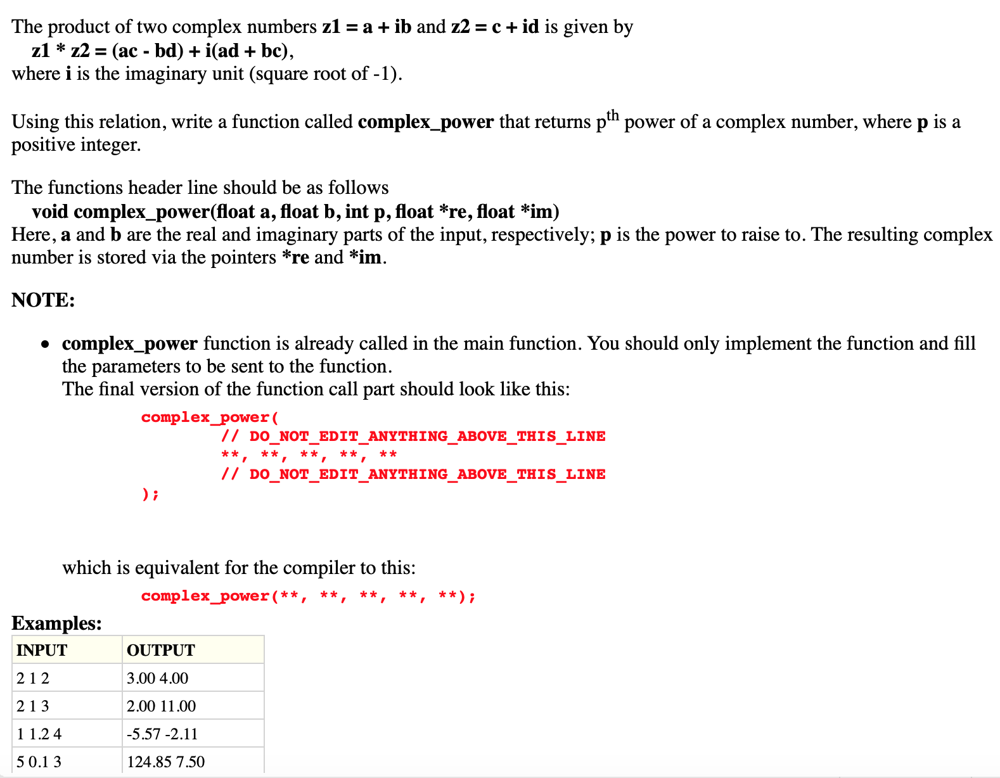
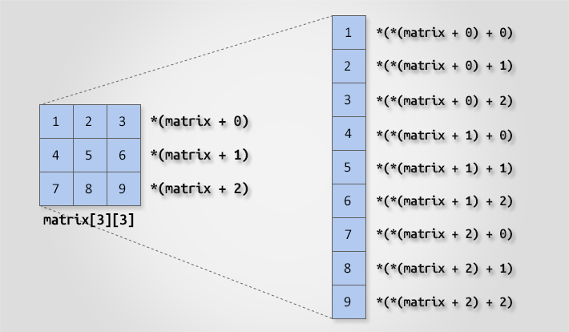

# Week 12 Notes - 21.05.2020
---
  
## Questions

### Q1 - Complex Powers (Old Midterm Question) (Pointers)

* Think about how we write the regular power.



### Q2 - Array with Pointer (Array, Pointers)

* Create a one dimensional array in the main function and initialize it with some integers. Then print the content of the array and the address of the each cell of the array using pointers. In other words, you are not allowed to use ``[ ]`` operators inside the loop you have written. You can use the size of the array in the loop you have written.

Example output:

```c
1 0x7ffee72153c0 2 0x7ffee72153c4 3 0x7ffee72153c8 4 0x7ffee72153cc 5 0x7ffee72153d0
```

### Q3 - 2D Array with Pointer (Multi-dim Array, Pointers)

* Create a two dimensional array in the main function and initialize it with some integers. Then print the content of the array and the address of the each cell of the array using pointers. In other words, you are not allowed to use ``[ ]`` operators inside the loop you have written. You can use the number of rows and number of columns in the loop you have written.

Example Output:
```c
1 0x7ffee3b6c3c0 2 0x7ffee3b6c3c4 3 0x7ffee3b6c3c8 
4 0x7ffee3b6c3cc 5 0x7ffee3b6c3d0 6 0x7ffee3b6c3d4 
7 0x7ffee3b6c3d8 8 0x7ffee3b6c3dc 9 0x7ffee3b6c3e0
```



### Q4 - Search (Teaching.Codes PS12-Ex3) (Array)

* Suppose we have a sorted array with size N. Write a function that finds a given number in this array, and returns the index of its location. If the number is not found, your function should return -1. Perform search by using binary search algorithm.


| Input1          | Input2 | Output                 |
| --------------- | ------ | ---------------------- |
| 0 2 3 4 7 8 8 9 | 5      | value not found        |
| 0 3 7 8 9       | 7      | value found at index 2 |

### Q5 - Shift the Matrix (Multi-dim Array)

Write a function called **rightShiftM()** that takes two integers as the sizes of the 2D array (N and M), a integer 2D array (arr) and an integer variable (T) as parameters. The function right shifts the 2D array T times.

Write a proper main function to see the effect of **rightShiftM()**.

|  INPUT  |  OUTPUT |
|-------|-------|
| 2 3 <br>1 2 3 <br>4 5 6 <br>4 | 3 4 5 <br>6 1 2 |
| 2 3 <br>1 2 3 <br>4 5 6 <br>8 | 5 6 1 <br>2 3 4 |

<br>

### Q6 - Palindrome (Strings)

* Write a function that takes a string and an integer as arguments and returns the length of the string if the string is a palindrome, otherwise returns 0. In the main, get input from the user into a string and call the function you have written. Print the output of the function.

[What is palindrome?](https://en.wikipedia.org/wiki/Palindrome)

| Input | Output |
| ----- | ------ |
| madam | 5      |
| rebel | 0      |

### Q7 - Put My Words (Strings)

* Write a program which reads a **sentence (string)**  a **word (string)** and a **positive integer number (int)**. Insert the word to the sentence as the given numbered word. Then the modified sentence will be printed.

* A sentence consists of words separated by spaces. There will be at least one word in a sentence. There will be exactly one space between each word in a sentence. A word consists of only letters (both lowercase and uppercase is possible). A sentence cannot be longer than 1000 characters. A word cannot be longer than 20 letters. The number can't be larger than the number of words in the sentence + 1.

**Reminder:** A string is a char array that has \0 character at the end.

**Reminder 2:** There shouldn’t be spaces or new lines at the end or the beginning of the sentence.


|  INPUT  |  OUTPUT |
|-------|-------|
| is my life now <br>1 <br>this | this is my life now |
| WHeN LiFe GiVeS You MaKe LeMoNaDe <br>5 <br>LeMoNs | WHeN LiFe GiVeS You LeMoNs MaKe LeMoNaDe |
| dont Wait for <br>4 <br>Opportunity | dont Wait for Opportunity |

```c
#include <stdio.h>
#include <string.h>

int main()
{
    int n;
    char sentence[1001], word[21];

    fgets(sentence, 1000, stdin);
    scanf("%d %s", &n, word);

    // DO_NOT_EDIT_ANYTHING_ABOVE_THIS_LINE


    // DO_NOT_EDIT_ANYTHING_BELOW_THIS_LINE

    printf("%s Cool", sentence);

    return 0;
}
```

<br>

### Q8 - Remove Non-Letters (Strings)

Write a program that takes a string from the user and removes the characters the non-letter characters. Of course the null character ``\0`` should stay. 

| Input        | Output |
| ------------ | ------ |
| h3ll0 w0r1d! | hllwrd |
| 2020 may 20  | may    |